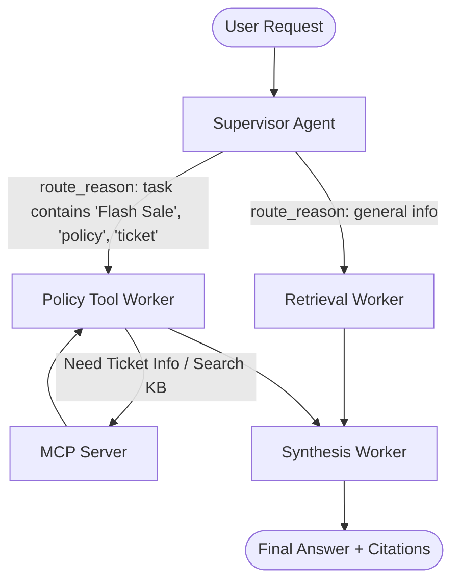

# System Architecture — Lab Day 09

**Nhóm:** Khánh - Minh - Thành 
**Ngày:** 14/04/2026  

---

## 1. Tổng quan kiến trúc

> Cấu trúc RAG Pipeline đã được chuyển sang dạng Graph đa luồng nhằm tối ưu khả năng đối soát chính sách kinh doanh và cấp quyền.

**Pattern đã chọn:** Supervisor-Worker  
**Lý do chọn pattern này (thay vì single agent):** Hệ thống có những luồng nghiệp vụ không liên quan đến nhau. Ví dụ: hỏi về FAQ thì cần tìm kiếm KB, hỏi về chính sách bảo hành Flash Sale hoặc cấp quyền Ticket Level 3 thì lại cần xử lý Rule-based từ API. Pattern Supervisor-Worker tách bạch được trách nhiệm, tránh việc AI sinh ra ảo giác khi ôm đồm và rút ngắn thời gian fix bug.

---

## 2. Sơ đồ Pipeline

> Vẽ sơ đồ pipeline dưới dạng text, Mermaid diagram, hoặc ASCII art.
> Yêu cầu tối thiểu: thể hiện rõ luồng từ input → supervisor → workers → output.

**Ví dụ (ASCII art):**
```
User Request
     │
     ▼
┌──────────────┐
│  Supervisor  │  ← route_reason, risk_high, needs_tool
└──────┬───────┘
       │
   [route_decision]
       │
  ┌────┴────────────────────┐
  │                         │
  ▼                         ▼
Retrieval Worker     Policy Tool Worker
  (evidence)           (policy check + MCP)
  │                         │
  └─────────┬───────────────┘
            │
            ▼
      Synthesis Worker
        (answer + cite)
            │
            ▼
         Output
```

**Sơ đồ thực tế của nhóm:**



---

## 3. Vai trò từng thành phần

### Supervisor (`graph.py`)

| Thuộc tính | Mô tả |
|-----------|-------|
| **Nhiệm vụ** | Tiếp nhận câu hỏi, phân loại và chuyển hướng luồng xử lý tới Worker phù hợp. |
| **Input** | `question_text` |
| **Output** | supervisor_route, route_reason, risk_high, needs_tool |
| **Routing logic** | If chứa keyword 'refund', 'policy', 'P1', 'cấp quyền' -> `policy_tool_worker`. Còn lại -> `retrieval_worker`. |
| **HITL condition** | Trigger nếu phát hiện rủi ro cao từ route_decision nhưng ở lab giới hạn scope nên tạm thời bypass. |

### Retrieval Worker (`workers/retrieval.py`)

| Thuộc tính | Mô tả |
|-----------|-------|
| **Nhiệm vụ** | Gọi vào CSDL ChromaDB để truy xuất các đoạn văn bản liên quan tới truy vấn sử dụng thuật toán Hybrid. |
| **Embedding model** | OpenAI text-embedding-3-small (đảm bảo độ chính xác cao hơn model local). |
| **Top-k** | Lấy 3 chunks. |
| **Stateless?** | Yes |

### Policy Tool Worker (`workers/policy_tool.py`)

| Thuộc tính | Mô tả |
|-----------|-------|
| **Nhiệm vụ** | Nhúng các ngoại lệ của công ty và gọi qua MCP tool khi có yêu cầu truy vấn Ticket cụ thể. |
| **MCP tools gọi** | `search_kb`, `get_ticket_info` |
| **Exception cases xử lý** | Đơn hàng Flash Sale, Digital Product không hoàn tiền, Sản phẩm đã kích hoạt. (Điều 3 - policy_refund_v4) |

### Synthesis Worker (`workers/synthesis.py`)

| Thuộc tính | Mô tả |
|-----------|-------|
| **LLM model** | gpt-4o-mini |
| **Temperature** | 0.0 (chống Hallucination tuyệt đối) |
| **Grounding strategy** | Đưa chunks hoặc policy_result giới hạn vào prompt và yêu cầu bắt buộc trích dẫn [tên_nguồn.txt]. |
| **Abstain condition** | Nếu context rỗng hoặc policy không được support (vd không tìm thấy ticket). |

### MCP Server (`mcp_server.py`)

| Tool | Input | Output |
|------|-------|--------|
| search_kb | query, top_k | chunks, sources |
| get_ticket_info | ticket_id | ticket details (mock data) |
| check_access_permission | access_level, requester_role | can_grant, approvers |
| get_sla_metrics | priority_level | resolution_time_minutes |

---

## 4. Shared State Schema

> Liệt kê các fields trong AgentState và ý nghĩa của từng field.

| Field | Type | Mô tả | Ai đọc/ghi |
|-------|------|-------|-----------|
| task | str | Câu hỏi đầu vào | supervisor đọc |
| supervisor_route | str | Worker được chọn | supervisor ghi |
| route_reason | str | Lý do route | supervisor ghi |
| retrieved_chunks | list | Evidence từ retrieval | retrieval ghi, synthesis đọc |
| policy_result | dict | Kết quả kiểm tra policy | policy_tool ghi, synthesis đọc |
| mcp_tools_used | list | Tool calls đã thực hiện | policy_tool ghi |
| final_answer | str | Câu trả lời cuối có trích dẫn nguồn (Markdown) | synthesis ghi |
| confidence | float | Mức tin cậy của Synthesis | synthesis ghi |
| hitl_triggered | bool | Cờ đánh dấu luồng xử lý Human in the Loop | supervisor đọc/ghi |

---

## 5. Lý do chọn Supervisor-Worker so với Single Agent (Day 08)

| Tiêu chí | Single Agent (Day 08) | Supervisor-Worker (Day 09) |
|----------|----------------------|--------------------------|
| Debug khi sai | Khó — không rõ lỗi ở đâu | Dễ hơn — test từng worker độc lập |
| Thêm capability mới | Phải sửa toàn prompt | Thêm worker/MCP tool riêng |
| Routing visibility | Không có | Có route_reason trong trace |
| Khả năng chuyên biệt hóa | Prompt quá lớn dễ nghẽn (Context window) | Tách nhỏ Prompt, tiết kiệm token tính toán logic |

**Nhóm điền thêm quan sát từ thực tế lab:**
Khi test độc lập `mcp_server.py`, chúng tôi phát hiện lỗi decode hệ thống và fix ngay trên cục Router mà không làm sụp hệ thống Graph ở diện rộng (Isolation rất tốt).

---

## 6. Giới hạn và điểm cần cải tiến

> Nhóm mô tả những điểm hạn chế của kiến trúc hiện tại.

1. Pipeline vẫn chạy tuần tự. Nếu Retrieval Worker mất 3s và Policy Worker chạy 4s, độ trễ dồn lên đáng kể. Có thể cải tiến bằng Async Tasks (Chạy song song) nếu rule không quá phụ thuộc.
2. Trách nhiệm Routing hiện mới chỉ dừng lại ở check Rule-based (Keyword match "refund", "ticket"). Nếu câu hỏi diễn đạt lắt léo mà không có keyword thì luồng bị phân bổ nhầm sang Retrieval thông thường. Cần cải thiện thành LLM As a Router (Bắn query hẹp nhờ LLM phân loại).
3. Thiếu Worker theo dõi phản hồi Audit Log. Hiện tại hệ thống không biết sau khi chẩn đoán xong người dùng có bằng lòng không.
